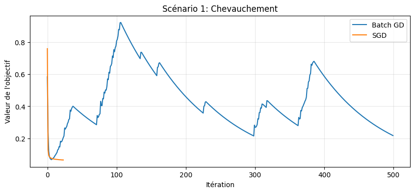
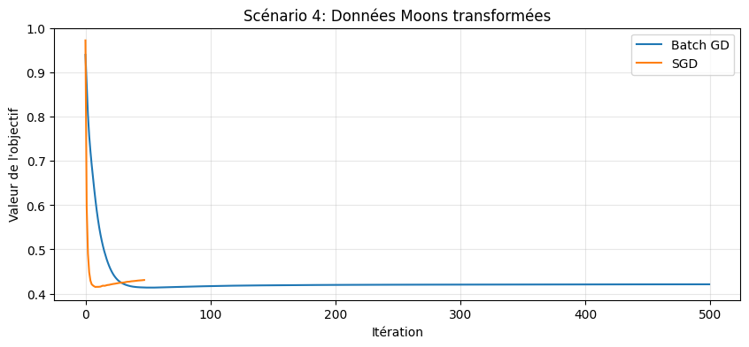
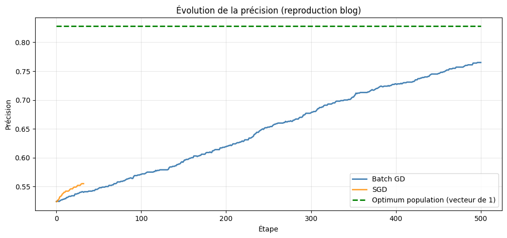
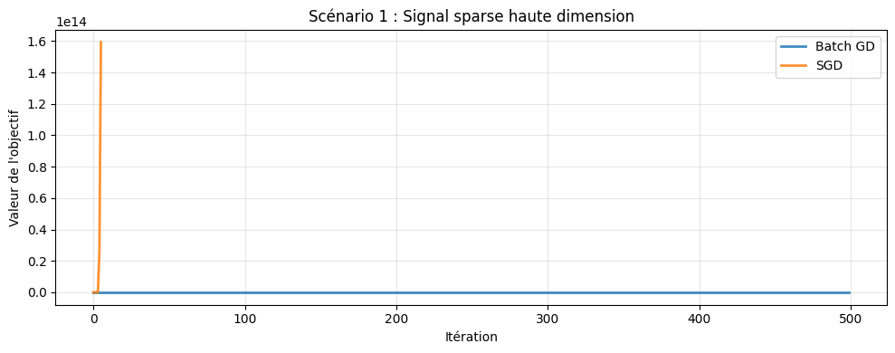
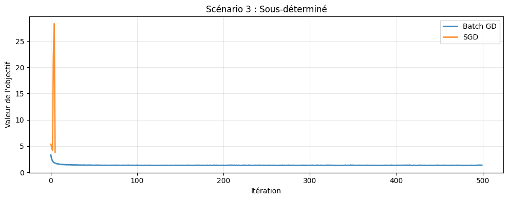
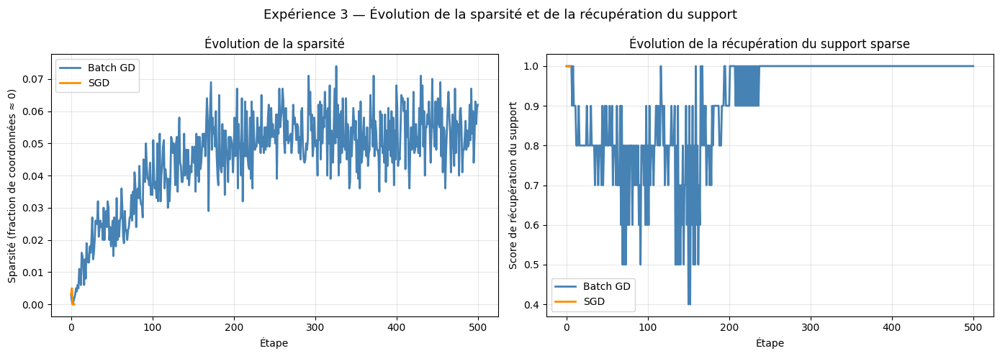

# Optimisation — SVM & LASSO

> **Two notebooks implementing and comparing gradient-based optimization algorithms on two classic machine learning problems: SVM classification and LASSO regression.**

*M2 MALIA — Optimisation Module | Maram NASR & Skander HAJ MABROUK*

---

## What is this project about? *(for non-technical readers)*

Machine learning models learn from data by **minimizing an error**. To do that, they need a mathematical strategy to find the best possible parameters — this is called **optimization**.

Think of it like finding the lowest point in a hilly landscape in the dark. You can't see the whole terrain, so you feel the slope under your feet and take a small step downhill. Repeat this enough times, and you'll reach the bottom. This is exactly what **gradient descent** does.

This project compares **two flavors** of this strategy:

| Method | What it does | Analogy |
|--------|-------------|---------|
| **Batch Gradient Descent** | Uses *all* the data at each step | Checking the full weather forecast before deciding which way to walk |
| **Stochastic Gradient Descent (SGD)** | Uses a small random sample at each step | Taking a quick glance at a few steps ahead and deciding immediately |

Each method has trade-offs: Batch GD is **more stable but slower**; SGD is **faster but noisier**. The two notebooks study these trade-offs on two different problems.

---

## Notebook 1 — SVM: Teaching a Machine to Draw Boundaries

**File:** `Projet_SVM.ipynb`

### What is an SVM?

A **Support Vector Machine (SVM)** is a classifier that draws the widest possible "street" between two categories of data. Imagine you're trying to separate photos of cats from photos of dogs — the SVM finds the boundary line that leaves as much space as possible on each side, making it more robust to new, unseen examples.

The challenge: finding that optimal boundary requires solving an optimization problem, which is where gradient descent comes in.

### What we did

We implemented both **Batch GD** and **SGD** from scratch to train a linear SVM, and tested them on four synthetic datasets representing real-world challenges:

| Scenario | Description | Challenge |
|----------|-------------|-----------|
| **Overlapping classes** | The two groups partly mix together | No perfect boundary exists |
| **Imbalanced classes** | One group is 4× larger than the other | Risk of ignoring the minority group |
| **High dimensionality** | 500 features but only 200 examples | Risk of overfitting |
| **Non-linear data** | Data shaped like two interleaved moons | A straight line can't separate them |

For the non-linear case, we used a **polynomial transformation** to project the data into a higher-dimensional space where a linear boundary becomes sufficient — a classical kernel trick.

### Key results

**Overlapping data** — SGD converges quickly while Batch GD oscillates before settling:

<p align="center">
  
</p>

**Non-linear moons** — Both methods converge smoothly once the polynomial transformation is applied:

<p align="center">
  
</p>

**Accuracy over time** — Both methods progressively improve their classification accuracy, approaching the theoretical optimum (dashed green line):

<p align="center">
  
</p>

### Main findings

- **SGD wins** on overlapping and well-separated data: its random noise helps it explore more and find better solutions faster
- **Batch GD wins** on high-dimensional and imbalanced data: its stable, full-data updates give it a more reliable direction downhill
- On non-linear data after polynomial transformation, **both methods perform equally** (~84% accuracy)

---

## Notebook 2 — LASSO: Finding the Signal in the Noise

**File:** `Projet_Lasso.ipynb`

### What is LASSO?

**LASSO** (Least Absolute Shrinkage and Selection Operator) is a regression technique that does two things at once:
1. **Fits a predictive model** (like linear regression)
2. **Selects the most important features** by automatically setting irrelevant ones to exactly zero

> **Concrete analogy:** Imagine you're trying to predict a house price using 1,000 variables (size, number of rooms, distance to metro, color of the front door, etc.). Most variables are useless noise. LASSO automatically identifies and uses only the handful that actually matter — making the model simpler, faster, and more interpretable.

This "zeroing out" property is called **sparsity**, and it's the key difference from standard regression. LASSO achieves it through an **ℓ1 penalty** that mathematically pushes small coefficients all the way to zero.

The catch: the ℓ1 norm is not smooth (it has a "corner" at zero), so we can't use a regular gradient — we need a **subgradient** instead, which is a generalization that handles this non-smoothness.

### What we did

We implemented Batch Subgradient Descent and SGD for LASSO from scratch, and tested them on four scenarios:

| Scenario | Description | Key question |
|----------|-------------|-------------|
| **Sparse high-dimensional** | 10 relevant variables out of 1,000 | Can the algorithm identify the right 10? |
| **Dense noisy signal** | All variables matter, with noise | Does LASSO still work when sparsity isn't natural? |
| **Underdetermined system** | More variables (200) than observations (50) | Can LASSO find the unique sparse solution? |
| **Intermediate sparsity** | 50 relevant variables out of 500 | Middle-ground robustness test |

### Key results

**Sparse high-dimensional data** — Batch GD converges perfectly while SGD diverges catastrophically with the same learning rate (the orange line explodes to 10¹⁴):

<p align="center">
  
</p>

**Underdetermined system** — Batch GD finds a stable solution while SGD shows initial instability before settling:

<p align="center">
  
</p>

**Sparsity & support recovery** — Over iterations, Batch GD progressively identifies the correct sparse variables (right panel reaches 1.0 = perfect recovery):

<p align="center">
  
</p>

### Main findings

- **Batch GD is strongly preferred** for LASSO: the ℓ1 subgradient is already noisy, and adding SGD's randomness on top leads to numerical instability in high dimensions
- **SGD is hypersensitive** to the learning rate: a value that works well for Batch GD can cause SGD to diverge completely
- **LASSO successfully identifies sparse signals**: in the ideal scenario (10 non-zero variables out of 1,000), Batch GD recovers the exact support with a perfect score of 1.0
- In dense settings, LASSO introduces a bias (it tries to zero out variables that shouldn't be zero), which is expected and well-understood

---

## Key Concepts — Glossary

| Term | Plain English |
|------|--------------|
| **Optimization** | Finding the best parameters for a model (minimizing an error) |
| **Gradient Descent** | Step-by-step downhill walk in the error landscape |
| **Batch GD** | Uses all data at each step — slow but stable |
| **SGD (Stochastic GD)** | Uses a small random sample — fast but noisy |
| **Learning rate** | The size of each downhill step (too big → overshoot, too small → slow) |
| **SVM** | Classifier that finds the widest margin boundary between two classes |
| **Hinge loss** | SVM's penalty: 0 if correctly classified with margin, positive otherwise |
| **LASSO** | Regression with ℓ1 regularization that forces irrelevant coefficients to zero |
| **Sparsity** | Having many zero coefficients — only the important features are kept |
| **Subgradient** | Generalization of gradient for non-smooth functions (used by LASSO) |
| **ℓ1 / ℓ2 regularization** | Penalties to avoid overfitting: ℓ1 promotes sparsity, ℓ2 promotes small values |

---

## How to Run?

```bash
# Clone the repo
git clone https://github.com/SkanderHAJMABROUK/svm-and-lasso-demonstrations
cd svm-and-lasso-demonstrations

# Install dependencies
pip install numpy matplotlib scikit-learn

# Launch Jupyter
jupyter notebook
```

Open `Projet_SVM.ipynb` or `Projet_Lasso.ipynb` and run all cells.

> Both notebooks are self-contained and generate all figures inline.

---

## Project Structure

```
.
├── Projet_SVM.ipynb          # SVM optimization notebook
├── Projet_Lasso.ipynb        # LASSO optimization notebook
# Figures used in this README
│   fig_svm_chevauchement.png
│   fig_svm_moons.png
│   fig_svm_precision.png
│   fig_lasso_haute_dim.png
│   fig_lasso_sous_determine.png
│   fig_lasso_sparsite.png
└── README.md
```

---

## Authors

**Maram NASR** & **Skander HAJ MABROUK**
M2 MALIA — Université Lumière Lyon 2
Optimisation Module — Academic Year 2025–2026
